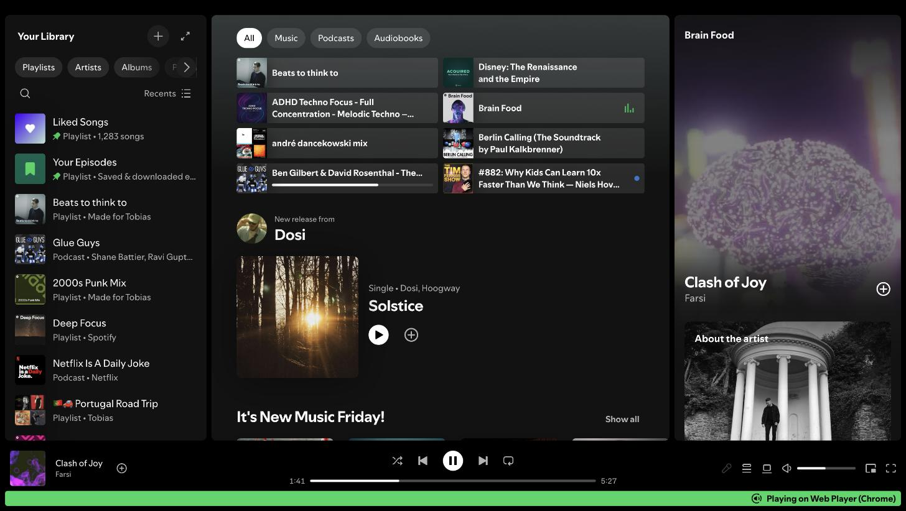
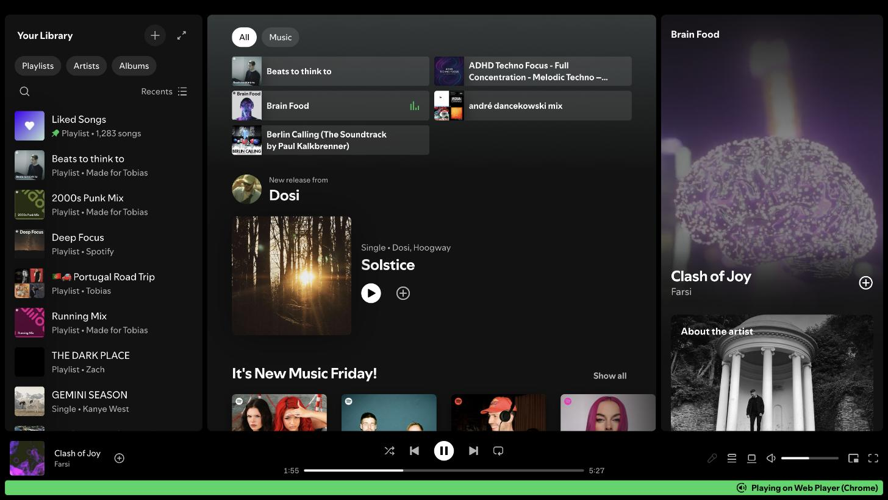

# nospopo

A Chrome extension that removes podcasts and audiobooks from the Spotify web
player. It changes the home page and the left sidebar only.

The goal is to keep Spotify for music, and to remove the pull of a new podcast
episode. The extension does not block spoken audio: search still finds a
podcast, and a direct link still plays it. It removes the invitation, not the
content.

## Before and after

The same Spotify home page, with the filter off and with the filter on. The top
bar is cut out of both pictures.

**Before** — the whole home page.



**After** — the same page with the filter on.



Three things change:

| Surface | Before | After |
|---|---|---|
| Filter chips | `All` `Music` `Podcasts` `Audiobooks` | `All` `Music` |
| Shortcut tiles | 8 tiles, 3 of them podcast episodes | 5 music tiles, no hole |
| Sidebar | `Your Episodes` and 2 podcast rows | playlists only |

The player keeps its position, and the music keeps playing.

## Install

1. Open `chrome://extensions`.
2. Switch **Developer mode** on, at the top right.
3. Click **Load unpacked**.
4. Select this folder.

Chrome keeps the extension after a restart. There is no build step.

## Use

The filter is on by default.

- **To switch it off:** click the icon, then drag the handle to the right end
  and hold it there for 1.5 seconds. A click does nothing. This friction is on
  purpose.
- **To switch it on:** click the icon, then click the button. One click.
- The filter switches itself on again after 30 minutes.
- The badge shows `OFF` in red while the filter is off.

## How it works

The extension hides content in two ways, because the home page and the sidebar
give different signals. On top of that, it asks Spotify for a home page that
holds no spoken audio in the first place.

| Surface | Signal | Example |
|---|---|---|
| Home page cards | The link path | `a[href^="/show/"]` |
| Home page feed cells | The link path, one level under the grid | `[data-testid="grid-container"] > *` |
| Sidebar rows | The Spotify URI | `aria-labelledby="listrow-title-spotify:show:…"` |

A static stylesheet (`src/content/filter.css`) does most of the work. Chrome
injects it before Spotify draws anything, so a card never appears. A small
script (`src/content/filter.js`) does the four jobs that CSS cannot do:

1. it keeps the on/off attribute in step with the stored state;
2. it sends a cold load of the home page to the music facet (see below);
3. it hides the shortcut tiles at the top of the home page, which carry no
   stable attribute;
4. it hides a shelf that holds no visible card or feed cell any more.

### The music facet

Spotify serves a music-only home page at
`https://open.spotify.com/home?facet=music-chip`. The server does the
filtering, so that page holds no podcast, no show and no audiobook at all. The
script sends a cold load of `/` or `/home` there, with `location.replace`, and
the reader sees one page load, not two.

The facet does not replace the rules. It only applies to a cold load: the Home
button inside the player is a button, not a link, and its router ignores the
URL. A step to the home page inside the player therefore lands on the whole
home page, where the rules above do the work.

While the filter is off, the script sends nobody anywhere. But a page that is
already on the music facet stays on it, because Spotify never sent the
podcasts. Click the `All` chip to see the whole home page again.

The extension hides elements. It never removes a node, so Spotify's React code
keeps its own view of the DOM.

The design and the DOM findings are in
`docs/superpowers/specs/2026-08-31-nospopo-design.md`.

## Privacy

The extension makes no network call and reads no account data. It stores one
value in `chrome.storage.local`: `enabled`.

Permissions: `storage`, `alarms`, and the host `https://open.spotify.com/*`.

## Develop

```sh
npm test        # unit tests, no dependency
npm run gen     # regenerate filter.css and the icons
```

`src/content/filter.css` and `icons/*.png` are generated and committed. The
single source of truth for every selector is `src/shared/rules.js`. `npm test`
fails when the generated CSS is out of date.

### Manual checklist

Run this after a change, on `https://open.spotify.com/`:

1. The home page shows no podcast, episode, show or audiobook card, and no
   large feed card with a picture and a description.
2. The home page shows no empty shelf, and no `Podcasts` or `Audiobooks` chip.
3. The shortcut tile grid at the top has no podcast tile and no hole.
4. The sidebar shows no show, no audiobook and no `Your Episodes` row.
5. Music playback still works.
6. Search still finds a podcast, and it still plays.
7. The drag control switches the filter off. The podcasts come back with no
   page reload, on every page but the music facet. On the music facet, the
   `All` chip brings them back.
8. The button switches the filter on again.
9. A cold load of `https://open.spotify.com/` lands on
   `https://open.spotify.com/home?facet=music-chip`.
10. A page reload keeps the state.
11. The filter switches itself on again after 30 minutes.

## When Spotify changes its markup

The badge shows a grey `?` when the home page holds no
`[data-encore-id="card"]` at all. That means the markup changed and the rules
need repair. The console holds one `[nospopo]` warning. The extension stops; it
never breaks the player.
